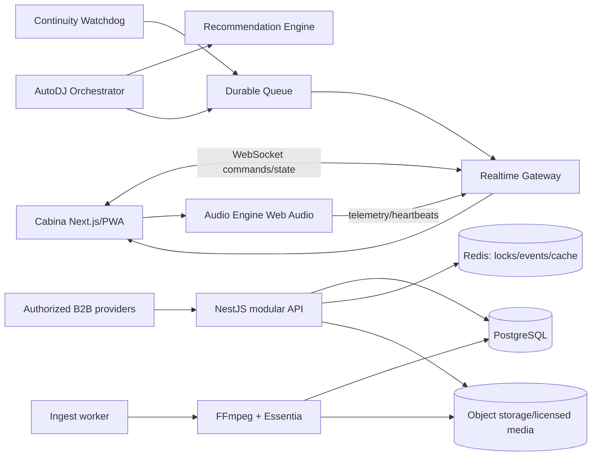
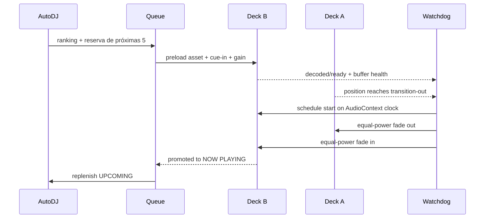

# AutoDJ AI — arquitectura de producto

## Decisión rectora y cumplimiento

El plano de audio acepta únicamente `PlayableAsset` con prueba de derecho de reproducción pública: archivo propio/licenciado, catálogo B2B contratado o proveedor que autorice expresamente mezcla y uso comercial. La licencia del software no sustituye las licencias de comunicación pública que corresponden al establecimiento y territorio.

- YouTube Data API puede servir para descubrimiento/enlaces con atribución. No es un deck: sus políticas prohíben separar o modificar audio, reproducción en segundo plano y más de un reproductor automático simultáneo.
- Spotify no es una fuente de audio: su política impide productos para bares/restaurantes, broadcasting no interactivo y solapar o mezclar contenido.
- Todo proveedor futuro implementa `CatalogProvider` y, solo si su contrato B2B lo permite, `PlaybackProvider`. Compliance habilita capacidades por tenant y territorio.

## Vista general



El audio se reproduce en el equipo de cabina para evitar que una caída del servidor corte la salida. Un Service Worker, IndexedDB y Cache Storage guardan manifiestos, estado de sesión y assets permitidos. El servidor coordina; el cliente posee un snapshot de contingencia de al menos 3 pistas.

## Componentes

1. **Control plane**: autenticación OIDC/passkeys, organizaciones/locales, RBAC, auditoría, biblioteca, playlists, solicitudes y programación de cuñas.
2. **Music intelligence**: ingestión de metadatos, waveform/peaks, LUFS, BPM, tonalidad Camelot, energía, segmentos intro/outro y confianza de análisis.
3. **Session orchestrator**: máquina de estados por cabina; modos AUTO, HYBRID y MANUAL; comandos idempotentes y versionados.
4. **Audio runtime**: Deck A/B con `AudioBufferSourceNode`, buses de ganancia, EQ opcional, limiter master y crossfade equal-power. Para archivos largos usa MediaElementSource con precarga; AudioWorklet se reserva para DSP en tiempo real.
5. **Continuity watchdog**: heartbeat de ambos decks, buffer health, deadline de transición, fallback local y pista de emergencia.
6. **Provider gateway**: búsqueda y metadatos separados de playback; capability matrix, rate limiting, circuit breaker y registro de licencias.

## Flujo de reproducción



## AutoDJ v1 explicable

Cada candidato pasa primero filtros duros: reproducible/licenciado, no bloqueado, disponible offline si se requiere, duración válida y separación mínima por pista/artista. Después:

`score = .30·bpm + .23·harmonic + .17·genre + .15·energy + .08·popularity + .07·requests - repetitionPenalty`

Cada factor se normaliza a 0..1. BPM admite half/double-time; armonía usa distancia Camelot; energía compara contra una curva objetivo por horario. La penalización combina recencia de pista, artista y versión. Las instrucciones se convierten a un `SessionIntent` validado (géneros, curva de energía, duración, siguiente bloque), nunca a comandos de audio libres. Se guarda el desglose del score para auditoría.

Evolución: contextual bandit que reordena candidatos usando skips, votos, aceptación de solicitudes y permanencia, con aislamiento por tenant, exploración limitada y baseline determinista siempre disponible. No se entrena con audio o datos de proveedores que lo prohíban.

## Mezcla

- Preanalizar LUFS-I/true peak, beats, downbeats, frases e intro/outro con FFmpeg + Essentia.
- Programar eventos sobre el reloj monotónico de `AudioContext`, no temporizadores del DOM.
- Crossfade equal-power: `gainA=cos(x·π/2)`, `gainB=sin(x·π/2)`; 4–16 s configurable.
- Beatmatch solo dentro de un margen seguro (inicialmente ±4%); si la confianza BPM/frase es baja se aplica transición musical por outro/intro sin time-stretch.
- Limiter master, objetivo de loudness configurable y rampas para evitar clicks. Nunca normalizar destruyendo dinámica del archivo original.

## Continuidad y recuperación

Estado normal: NOW cargado, NEXT decodificado y tres UPCOMING resolubles. A T-30 s el deck entrante debe estar listo; a T-15 s se activa fallback; a T-5 s se usa asset local de emergencia. Errores usan circuit breaker por proveedor, retry con jitter solo fuera del deadline y DLQ para assets defectuosos. El estado se checkpointa cada cambio, los comandos llevan `commandId` y la recuperación rehidrata sesión/posición. La pista de emergencia y un bloque local de 30 minutos son obligatorios por local.

## Seguridad y multiempresa

Todas las entidades llevan `tenantId`; PostgreSQL RLS aporta defensa adicional. Roles ADMIN, DJ y OPERATOR se asignan por local. URLs de media son firmadas y cortas; hashes validan archivos; uploads pasan cuarentena. Secretos en vault, TLS, CSP estricta, rate limits, auditoría append-only y backups con pruebas de restauración. Los eventos sensibles registran actor, dispositivo, tenant, IP, before/after y correlation ID.

## Interfaz

Desktop-first 1440p: decks y waveform al centro; cola NEXT/UPCOMING fija a la derecha; biblioteca e inteligencia abajo; barra superior con modo, salud offline y salida. Colores reservados por semántica: cian=control/selección, verde=seguro/on-air, ámbar=degradado, rojo=riesgo. Atajos de teclado requieren confirmación visual y las acciones destructivas sobre NOW/NEXT tienen guardas.

## Tecnologías

- Next.js + React + TypeScript + Tailwind; PWA, Web Audio API, AudioWorklet y IndexedDB.
- NestJS modular monolith inicialmente; WebSocket/Socket.IO con secuencias y resync.
- PostgreSQL + Prisma; Redis para locks, cache y streams; S3/MinIO para media.
- Workers BullMQ; FFmpeg para transcodificación/peaks/LUFS; Essentia nativo en workers y WASM para análisis puntual.
- OpenTelemetry, Prometheus/Grafana, Sentry; Playwright, Vitest y k6.

## Estructura objetivo

```text
apps/
  web/                 cabina, administración y QR/PWA
  api/                 NestJS control plane y realtime gateway
  worker-analysis/     FFmpeg/Essentia y waveform
packages/
  audio-engine/        Decks, mixer, scheduler, watchdog
  recommendation/      scoring, intents y políticas
  contracts/           eventos, DTO y schemas Zod
  db/                  Prisma, migraciones y RLS
  ui/                   design system
infra/                 Docker, Kubernetes, observabilidad
docs/                  ADR, cumplimiento, runbooks
```

La V1 del repositorio mantiene `src/` para arrancar rápido; la separación monorepo ocurre al introducir API/worker, sin distribuir prematuramente el sistema.

## Roadmap

1. Arquitectura, threat model, capability matrix y UX de cabina.
2. Biblioteca local: upload, análisis, deduplicación y modelo multiempresa.
3. Audio engine Deck A/B, scheduling, mezcla y dispositivo de salida.
4. Cola durable, historial, playlists y modos AUTO/HYBRID/MANUAL.
5. AutoDJ determinista, parser de intents y explicación de ranking.
6. Cuñas con reglas, solicitudes QR moderadas y votación antifraude.
7. Offline/PWA, watchdog, chaos tests y pista de emergencia.
8. Integraciones B2B contractualmente autorizadas y compliance por país.
9. Piloto controlado, telemetría, accesibilidad, seguridad y afinación DSP.
10. SaaS: billing, provisioning, SLO 99.95% del control plane y soporte operativo.

## Criterios de salida del MVP comercial

Prueba continua de 12 horas sin gap audible sobre biblioteca sana; recuperación automática ante asset corrupto, red caída y API caída; P95 de comando menor a 150 ms en LAN; cero cruces de tenant en pruebas; RPO 5 min/RTO 30 min del control plane; auditoría y derechos de cada asset verificables.
